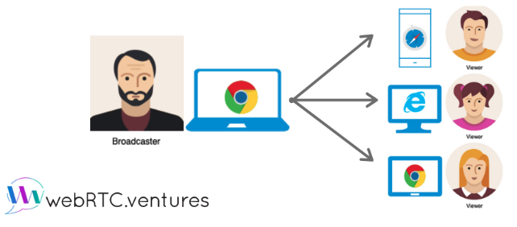
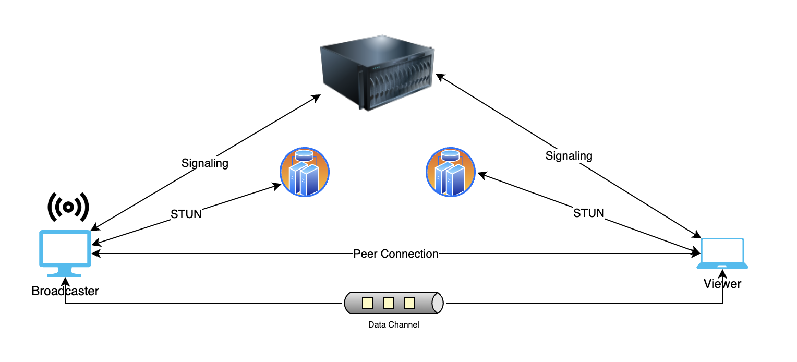
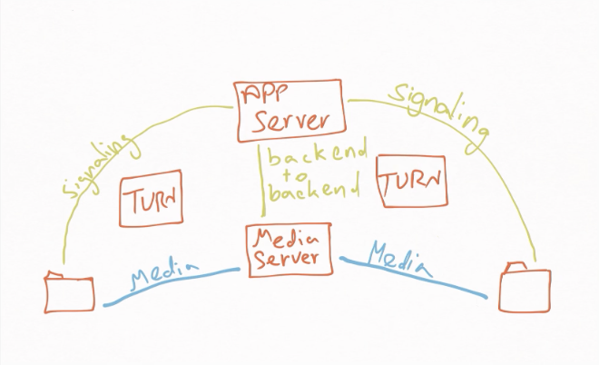

# Introducing Home Meet: A Broadcasting-Based WebRTC Application

Are you tired of video conferencing apps that limit the number of participants or require users to download an app? If so, you'll be excited to learn about Home Meet, a new broadcasting-based application built with WebRTC.

Home Meet is designed to simplify the process of setting up and joining a video broadcast. With Home Meet, users can join a broadcast with just a click of a button, without the need for any app downloads or registrations. The application is built using WebRTC, which provides high-quality video and audio streaming without the need for any additional plugins or software.

The Home Meet platform is perfect for businesses that require video broadcasting for meetings, conferences, or webinars. It's also an excellent tool for anyone who wants to create and share content with a large audience. Home Meet provides a simple and intuitive interface, making it easy to set up and manage broadcasts.

In this blog post, we will take a closer look at Home Meet, exploring how it works and the benefits it offers. We'll dive into the key features of the application and highlight why it's a great choice for your broadcasting needs. So, whether you're looking for a reliable way to host virtual events or simply want an easy way to share content with others, Home Meet has got you covered!

**Home Meet is a modern broadcasting-based application built with cutting-edge technologies including:**

- Node.js
- TypeScript
- React
- Next.js
- Nest.js
- MongoDB
- Socket.io
- WebRTC
- Ant Design
- Tailwind CSS
- Nx (Mono Repo)

The application is designed to simplify the process of setting up and joining a video broadcast, making it an ideal choice for businesses and individuals who require high-quality video broadcasting.

Home Meet is designed with two main actors: the Broadcaster and the Viewer. Each broadcast has a single Broadcaster and one or multiple Viewers.

## Viewer

The Viewer maintains a single RTCPeerConnection to the Broadcaster and creates a send data channel which he or she uses to send messages or text to the Broadcaster.

## Broadcaster

The Broadcaster maintains 'n' RTCPeerConnections, where the 'n' represents the number of Viewers and the RTCPeerConnection that links them. The Broadcaster also maintains 'n' receive data channels for receiving messages or text from Viewers.

The architecture of Home Meet is designed in such a way that it ensures seamless communication between the Broadcaster and the Viewer, ensuring that each broadcast is delivered with high-quality video and audio streaming.




# Home Meet Features

Home Meet offers a range of features to ensure seamless communication between broadcasters and viewers, including:

- Login: Users can log in to the application to access the features available to registered users.
- Signup: New users can sign up for an account to gain access to the application.
- Create meeting: Users can create new meetings and invite others to join them.
- View all meetings: Users can view all the meetings they have created and those created by other users.
- Join existing meetings as a viewer or broadcaster: Users can join meetings created by others as either a viewer or broadcaster.
- Prevent a second broadcaster from joining a room where there is already one: Home Meet is designed to prevent more than one broadcaster from joining a meeting.
- Enable audio communication and add a “mute/unmute audio” button: Users can communicate with each other using high-quality audio streaming. The Broadcaster has the ability to mute or unmute their audio at any time.
- Provide drop-downs for the broadcaster to select and switch their camera or microphone: The Broadcaster can select and switch between their camera and microphone to ensure high-quality streaming during the meeting.
- Enable viewers the ability to chat with the broadcaster using DataChannels: Viewers can communicate with the Broadcaster using the DataChannels feature.
- Enable broadcasters to end a meeting: The Broadcaster has the ability to end the meeting at any time.

## Workflow

The workflow for using Home Meet is as follows:

1. When a user first visits the application, they need to log in to access the features available to registered users.
2. To log in, they can either sign up for an account or log in with an existing account.
3. Once logged in, users can join or create meetings.
4. Users can also view all the meetings they have created and those created by other users.
5. To join a meeting, users can either join as a viewer or broadcaster.
6. If a user joins as a viewer, they can communicate with the Broadcaster using the DataChannels feature.

# Running the Home Meet Application

Before running the Home Meet application, make sure you have the following dependencies installed:

- MongoDB
- Node.js

Once you have these dependencies installed, follow these steps to run the application:

1. Clone the Home Meet repository to your local machine.
2. Open a terminal or command prompt and navigate to the Home Meet directory.
3. Run `npm install` to install all the necessary dependencies for the application.
4. Run `npm run clean` to clean any existing build files.
5. Finally, run `npm start` to start the Home Meet server.

By default, the Home Meet frontend runs on port 3000 and the backend runs on port 5001. To access the application, follow these steps:

1. Open your web browser and go to `http://localhost:3000` to access the Home Meet frontend.
2. To access the backend, go to `http://localhost:5001`. Note that this will not display anything in the browser, as it is the backend API.
3. To view the endpoints available in the backend, you can use Swagger UI by going to `http://localhost:5001/api`. This will display a list of all available endpoints in the Home Meet backend API.

## Home Meet Folder Structure

Home Meet is a monorepo based on NX. NX is a set of Angular CLI power-ups for modern development that allows for faster and more consistent development of web applications.
The folder structure of the Home Meet repository is as follows:

```
home-meet/
├── apps/
│ ├── home-meet-server/
│ ├── home-meet-web/
├── libs/
├── tools/
├── .gitignore
├── .npmrc
├── .prettierrc
├── angular.json
├── nx.json
├── package.json
├── README.md
├── tsconfig.base.json
├── tsconfig.json
```

As you can see, the `apps/` folder contains the two main applications of the Home Meet project: `home-meet-server/` for the backend signaling server and `home-meet-web/` for the main UI part of the application.

Finally, the Home Meet repository contains configuration files such as `nx.json`, `package.json`, and `README.md`,`.npmrc` and `.prettierrc` for npm and Prettier configuration, respectively.

For more information on how NX works, you can visit their website [here](https://nx.dev/).

# Issues with the Architecture

While the architecture provides a solid foundation for building the application, there are some potential issues that can arise:

1. For actors that are behind NAT and have restricted access, a TURN server may be needed to ensure proper connection and communication.

2. The broadcaster's end can handle only up to 5 peer connections, and scaling beyond that may cause performance issues.

3. Maintaining a stable connection and avoiding packet loss may be challenging in situations where the network bandwidth is limited or inconsistent.

4. Network Latency and Bandwidth: Depending on the quality of the network connection, there may be issues with latency and bandwidth, which can affect the overall quality of the audio and video communication.

5. Error Handling: There may be situations where errors occur during communication, and proper error handling mechanisms must be in place to handle such situations.

6. Maintenance and Upgrades: As the technology stack evolves, there may be a need to update the architecture, which may require significant maintenance and upgrades.

7. Testing: Testing the architecture thoroughly can be a challenge, as it involves multiple components and interactions between different actors.

Despite these potential issues, the architecture provides end-to-end encryption, which is a major advantage in terms of security and privacy.

## Improved Architecture Proposal

To address some of the issues with the current architecture, we propose an SFU (Selective Forwarding Unit) based architecture, which can help scale the application.

The following components will be used:

- STUN server: to help with NAT traversal
- TURN server: to help with NAT traversal and to relay traffic for clients that cannot establish a direct connection
- Signaling server: to facilitate peer-to-peer communication and coordinate sessions between clients
- Media server (e.g. mediasoup): to handle the media streams between clients



Additionally, we will use insertable streams for end-to-end encryption.

With this architecture, clients will establish a connection with the media server, which acts as an SFU and relays the media streams to all other clients. This allows for better scalability compared to the current architecture, where a broadcaster can only handle up to 5 connections.

To implement this architecture, we can use mediasoup and mediasoup-client, which provide a simple yet powerful API for building SFU-based applications.

Benefits of using a media server include:

- Improved scalability and performance
- Ability to handle large number of clients
- Reduced bandwidth usage compared to mesh-based architectures
- Improved privacy and security with end-to-end encryption
- Transcoding: converting media formats to ensure compatibility across different devices and networks.
- Recording: recording the media stream for future playback or archiving.
- Mixing: combining multiple media streams to create a composite output.
- Filtering: applying effects or filters to the media stream.

Overall, this architecture can help address some of the issues with the current architecture and provide a more scalable and reliable solution for audio and video communication.
